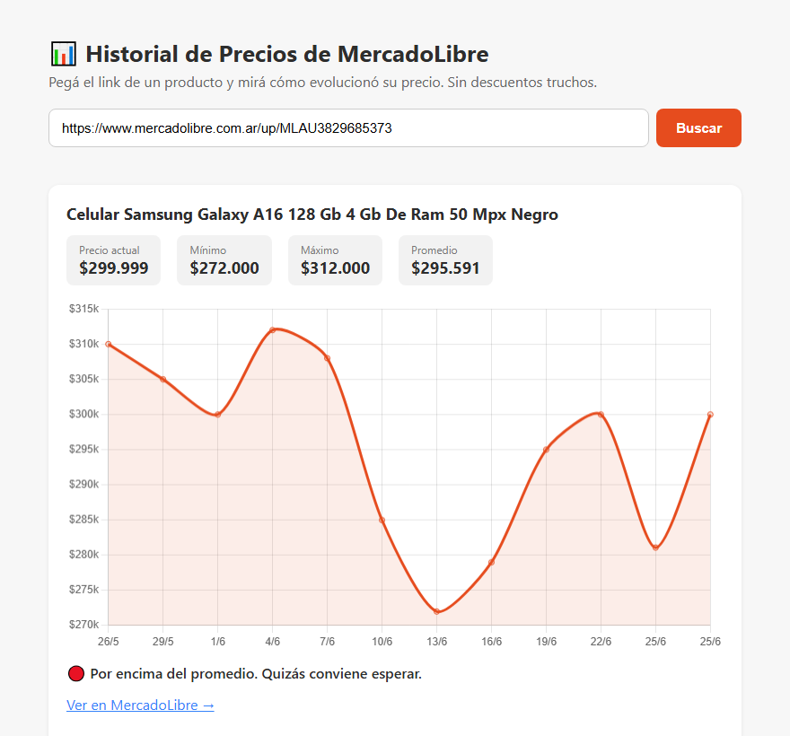

# Bajó el Precio

Seguimiento histórico de precios en Mercado Libre. Pegás el link de un producto
y ves cómo se movió su precio en el tiempo, con un veredicto de si el precio de
hoy es realmente bueno.

**El problema que resuelve:** una publicación que dice *"40% OFF"* no te dice
nada. El precio pudo haber subido la semana pasada justamente para que el
descuento parezca más grande. Sin la serie histórica no hay forma de distinguir
una baja real de un descuento fabricado — y esa serie hay que construirla día a
día, porque nadie la publica.



---

## Cómo funciona

```
Scraper (Playwright) ──> PostgreSQL ──> API (Express) ──┬─> Web
      ▲                  serie temporal                 ├─> Extensión de navegador
      │                                                 └─> Bot de Telegram
   Tracker en loop                                            │
   (re-scrapea y agrega un punto)                        Alertas de baja
```

El valor no está en el scraper: está en **acumular la serie temporal**. Un
precio suelto no dice nada; mil precios en el tiempo son el producto.

---

## Decisiones técnicas que vale la pena mirar

**El scraper lee el precio real, no el primero que encuentra.** Mercado Libre
muestra varios precios en una misma página —el del vendedor, el del catálogo, el
de cuotas— y el que importa es el "Mejor precio" del catálogo. Además hay que
manejar el caso de los centavos, que vienen en un nodo aparte del DOM y si no se
leen dan un precio equivocado por dos órdenes de magnitud.
→ [`src/ml/price-reader.js`](src/ml/price-reader.js)

**Los links de Mercado Libre tienen cuatro formatos distintos** (`/p/`, `/up/`,
item directo y los cortos de `meli.la`) y todos apuntan al mismo producto. Sin
normalizarlos, el mismo producto se trackea varias veces y la serie se parte.
→ [`src/link-parser.js`](src/link-parser.js) · [`src/link-expander.js`](src/link-expander.js)

**Postgres embebido para desarrollo, sin Docker.** `node scripts/db.js` levanta
una instancia real de Postgres en `localhost:5433`. Mismo motor que producción,
sin pedirle a nadie que instale nada.
→ [`scripts/db.js`](scripts/db.js)

**El bot de Telegram es la interfaz, no un extra.** Mandás un link, quedás
suscripto a las bajas de ese producto y te llega el aviso cuando baja de verdad.
Nadie abre una web para chequear un precio todos los días; un mensaje sí lo lee.
→ [`src/bot.js`](src/bot.js) · [`src/alerts.js`](src/alerts.js) · [`src/telegram.js`](src/telegram.js)

**Publicación automatizada.** El sistema genera las imágenes de las ofertas y
las publica solo, para que el canal siga vivo sin intervención manual.
→ [`src/ig-image.js`](src/ig-image.js) · [`src/instagram.js`](src/instagram.js) · [`src/twitter-store.js`](src/twitter-store.js)

---

## Stack

| Capa | Tecnología |
|---|---|
| Backend | Node.js (ESM) · Express · Prisma 6 |
| Scraping | Playwright con manejo anti-bot |
| Base de datos | PostgreSQL — embebido en local, Supabase en producción |
| Frontend | Web estática con Chart.js · React para el panel |
| Extensión | Extensión de navegador que inyecta el historial en la página de ML |
| Mensajería | Bot de Telegram (webhooks con verificación de token) |
| Pagos | Mercado Pago para los planes |
| Deploy | Fly.io (backend + volumen para el perfil del navegador) |

---

## Correrlo en local

```bash
# 1) Postgres local (dejar corriendo en otra terminal)
node scripts/db.js

# 2) Crear las tablas (solo la primera vez)
node node_modules/prisma/build/index.js migrate dev

# 3) Datos de ejemplo, para ver el gráfico sin esperar días
node --env-file=.env scripts/seed-demo.js

# 4) API + frontend  →  http://localhost:3000
node --env-file=.env src/server.js
```

El motor que acumula el historial va aparte:

```bash
node --env-file=.env src/tracker.js
```

Re-scrapea todo lo trackeado y agrega un punto nuevo a cada serie. Corriéndolo
en loop es como se construye el histórico.

Copiá `.env.example` a `.env` y completá los valores. **Ningún secreto está
versionado** — ni siquiera en el historial de commits.

---

## API

| Método | Ruta | Qué hace |
|---|---|---|
| `POST` | `/api/track` | Recibe `{ url }`, scrapea, guarda y devuelve el historial |
| `GET` | `/api/product/:id` | Historial de un producto ya trackeado |
| `GET` | `/api/products` | Lista de productos en seguimiento |

---

## Estado

Funcionando de punta a punta: scraper, base, API, web, extensión, bot de
Telegram con alertas y publicación automatizada. **Hoy está apagado por costos
de infraestructura**, no por fallas.

Lo más honesto que se puede decir de un proyecto así: el código funciona, y la
serie de precios sólo tiene valor si el tracker corre todos los días. Eso último
es un problema de plata, no de ingeniería.
